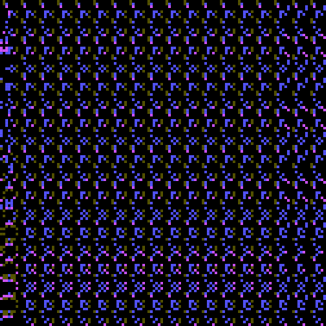

🚧🚧🚧🚧🚧🚧🚧🚧🚧🚧🚧🚧🚧🚧🚧🚧🚧🚧🚧🚧🚧🚧🚧🚧🚧🚧🚧🚧🚧🚧🚧🚧🚧🚧🚧🚧🚧
# fx(sieve) boilerplate alpha

A boilerplate to automate and ease the creation of Generative Tokens on fx(hash) using fx(params).

### Scope

- provide a local environment in which you can iterate and use modern features from the javascript ecosystem
- interactive environment to test your project with different seeds and params, called fx(lens)
- automate the creation of a .zip file ready to be uploaded on fxhash

### Prerequisites

- node >= 14
- npm >= 6.14.4

### Getting started

- Download this repository.
- Open the main folder in the terminal.
- Install dependencies and fx(lens): `npm install`

## Start developing your token project

- `npm start`: Starts a local http server serving your project within fxlens and hot reloading enabled
- Your browser should open automatically otherwise visit `http://localhost:3000/?target=http://localhost:3301/` to see your project in the browser

### fx(sieve) snippet / fx(snippet)

fxhash requires you to use a javascript code snippet so that the platform can inject some code when tokens will be generated from your Generative Token. The code snippet is already in the `index.html` file of this boilerplate, so you don't have to add it yourself.

**During the development stages, the snippet will generate a random hash each time the page is refreshed**. This way, it helps you reproduce the conditions in which your token will be executed on fxhash.

# Texture Generator using Sieve

This code provides a texture generator that utilizes a sieve algorithm to create visually interesting patterns. The generated texture is displayed on an HTML canvas element and allows users to interact with the code and download the generated image.

## Prerequisites
- HTML5 compatible web browser.

### JavaScript Functions
- `generateSieve(n)`: Generates a sieve of Eratosthenes up to the given number `n`.
- `generateStatic()`: Generates the texture on the canvas using the sieve algorithm and other settings.

## Usage and Customization
- The `minPolySize` and `maxPolySize` variables define the minimum and maximum size of the polygons in the texture.
- The `residues` array contains the residue values used to determine if a polygon should be drawn at a specific position.
- The `colors` array holds the color codes for the polygons.
- The `colorRangeLetters` array defines the range of colors to use for the polygons.
- The `hexValues` object maps color range letters to hexadecimal values for color manipulation.
- The `c.width` and `c.height` variables set the dimensions of the canvas.
- Adjusting these variables will modify the appearance of the generated texture.

## License
This code is provided under the [MIT License](https://opensource.org/licenses/MIT).

Please note that this code is provided as-is and no guarantees are made regarding its functionality or performance.

The fx(snippet) exposes two different way  to retrieve fx(params) values:

- `getParam` and `getParams` will return the transformed values as described above
- `getRawParam` and `getRawParams` will return the raw values after being serialized from the bytestring and without any transformation

## Start your project with fx(lens)

The fx(lens) offers an interactive environment to tweak and develop your generative token project.

- `npm start`: Starts two local http server
  - `localhost:3301` serves your project with live reloading
  - `localhost:3300` serves fx(lens) you can connect to a token
- Visìt `http://localhost:3300/?target=http://localhost:3301` to see your local project within fx(lens)

## Publish your project

> **⚠️ Disclaimer**: Sandbox is not yet compatible with fx(params).

- `npm run build`: Will create `dist-zipped/project.zip` file

Go to https://fxhash.xyz/sandbox/ and upload the project.zip file in there to see if it works properly. If your token does not work properly, you can iterate easily by updating your files, running $ npm run build again, and upload the zip file again.

Finally, you can mint your token using the same `project.zip` file.

